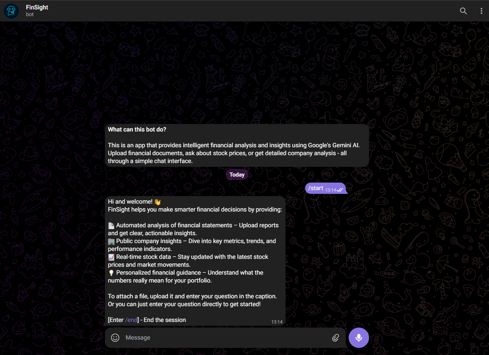
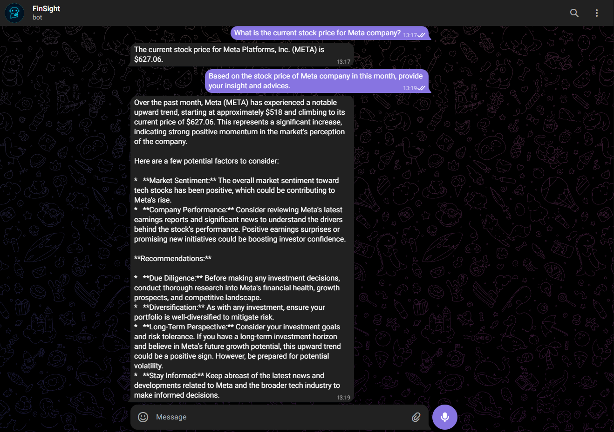
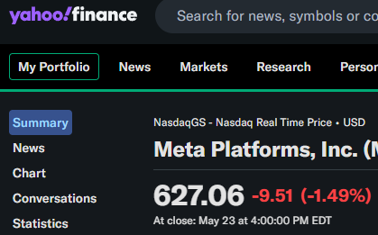
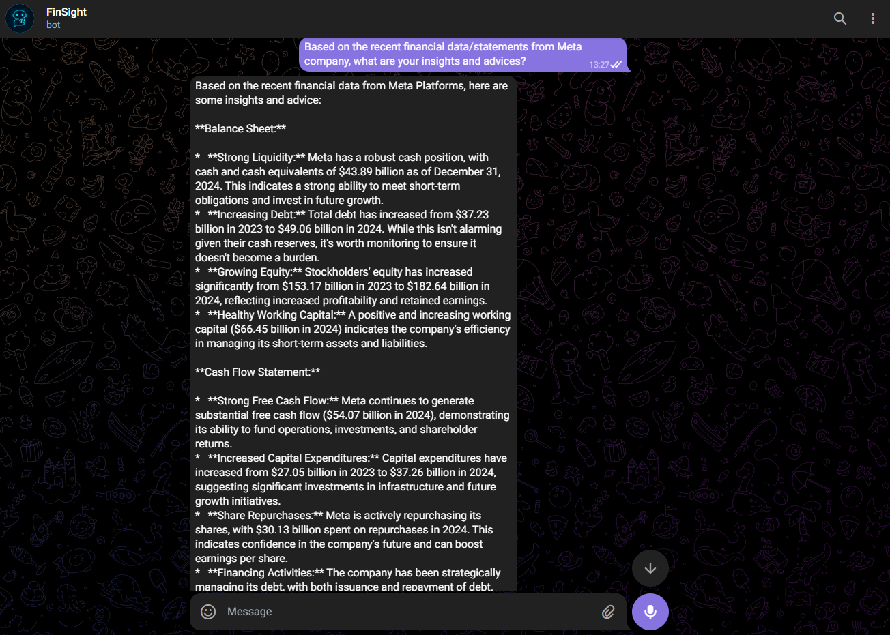
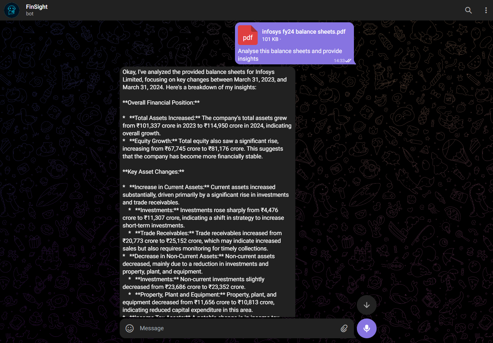

# FinSight - Telegram Financial Advisor Bot

This app is created by [@weng_siong](https://www.linkedin.com/in/ws-chan/). It is a Telegram bot that provides intelligent financial analysis and insights using Google's Gemini AI. Upload financial documents, ask about stock prices, or get detailed company analysis - all through a simple chat interface.

## Features

- 📊 **Real-time Stock Data** - Get current prices and historical data for any publicly traded company
- 📄 **Financial Statement Analysis** - Upload files and receive detailed analysis
- 🏢 **Company Insights** - Access income statements, balance sheets, and cash flow data
- 💡 **AI-Powered Guidance** - Personalized financial advice powered by Gemini AI

## Prerequisites

- Python 3.8+
- Google Gemini API Key
- Telegram Bot created from BotFather
- Telegram Bot Token
- **Public HTTPS URL** (required for webhook functionality)

## Installation & Setup

### Important Note About Local Development

**This application uses webhooks and cannot be run locally without modifications.** Webhooks require a public HTTPS URL that Telegram can reach. 

**Options for development:**

1. **Deploy directly to a cloud service** (Recommended - see Deployment section)
2. **Use ngrok for local development:**
   ```bash
   # Install ngrok and expose your local server
   ngrok http 5000
   # Use the ngrok HTTPS URL for webhook setup
   ```
3. **Modify the code to use polling instead of webhooks** (requires code changes)

### Cloud Deployment Setup

Since this app requires a public HTTPS URL, follow the deployment steps below to get it running.

## Available Commands

- `/start` - Initialize the bot and get welcome message
- Upload financial documents (PDF, CSV, Excel) for AI-powered analysis
- Ask questions about companies, financial metrics, or stock prices

## Overview of Usage

### How It Works

1. **Message Processing**: The bot receives messages through Telegram webhooks
2. **AI Analysis**: User queries are processed by Google Gemini with financial function calling
3. **Data Retrieval**: Latest stock data or financial statements are fetched using yfinance library in function calling
4. **Response Generation**: AI generates human-readable financial insights
5. **Message Delivery**: Responses are sent back through Telegram API

### Getting started

Send the `/start` command to the bot



### Getting stock information and insights



The information generated is accurate as of the date of the stock price (as shown below):



### Getting financial statements information and analysis



### File Analysis



## Key Notes

- This app is built using Flask and Python
- The app is deployed on Render.com
- **Webhook requirement**: The app must have a public domain name with HTTPS enabled
- Uses Google Gemini AI for intelligent financial analysis
- Integrates with yfinance for real-time stock data

## Telegram Bot Setup

### Create a new bot

1. Go to [BotFather](https://t.me/botfather)
2. Send the `/newbot` command
3. Enter the name of your bot
4. Enter the username of your bot (the name must end with `bot`)
5. Copy the bot token for your application

### Set the bot's description and profile picture

1. Go to [BotFather](https://t.me/botfather)
2. Send the `/setdescription` command
3. Select the bot you want to set the description for
4. Enter the description of your bot
5. Send the `/setuserpic` command
6. Select the bot you want to set the profile picture for
7. Send the profile picture of your bot

## Deployment

The app is deployed on Render.com.

### Deployment Steps

1. Connect your repository to Render.com
2. Create a new web service
3. Enter the name of your web service
4. Keep the `Language` as Python3
5. Keep the `Branch` as `main`
6. Keep the build command as `pip install -r requirements.txt`
7. Keep the start command as `gunicorn app:app`
8. Select Instance Type as `Free` for hobby project
9. Add the following environment variables:
    ```bash
    TELEGRAM_API_KEY=your_telegram_api_key
    GOOGLE_API_KEY=your_google_api_key
    ```
10. Deploy the application

### Post Deployment - Setup Webhook

Once the app is deployed, you can setup the webhook URL to the Render.com URL by visiting the `/setup_webhook` endpoint and pass in the Render.com URL + `/webhook` as the URL parameter:
```bash
https://<your-render-app-url>/setup_webhook?url=https://<your-render-app-url>/webhook
```

Once the webhook is setup, you can start the bot on Telegram by sending the `/start` command.

You can now start using the bot.

> **Webhook Management Endpoints:**
>
> You can visit these endpoints to manage your webhook:
> - `/setup_webhook?url=<webhook_url>` → Set up new webhook
> - `/get_webhook_info` → Check current webhook status
> - `/delete_webhook` → Remove existing webhook


## Technical Specifications

- **Supported File Formats**: PDF, CSV, Excel (.xlsx, .xls)
- **Stock Exchanges**: NASDAQ, Dow Jones, S&P Index, and other major global exchanges via yfinance
- **Rate Limits**: Follows Telegram Bot API limits (30 messages per second)
- **File Size Limit**: Maximum 50MB per file upload (Telegram Bot API limit)
- **Webhook Requirements**: Public HTTPS URL required for production deployment

### Getting Help

If you encounter issues:
1. Check the webhook status at `/get_webhook_info`
2. Verify your API keys are correctly set in Render.com environment variables
3. Check the application logs on Render.com dashboard
4. Ensure your Render.com app hasn't gone to sleep (free tier limitation)

## Disclaimer

**Important**: This application is for educational and informational purposes only. The financial analysis and insights provided should not be considered as professional financial advice. Always consult with qualified financial advisors before making investment decisions. The creators are not responsible for any financial losses incurred from using this bot.

## References

- [Google Gemini API](https://ai.google.dev/gemini-api/docs/quickstart)
- [Telegram Bot API](https://core.telegram.org/bots/api)
- [yfinance](https://pypi.org/project/yfinance/)
- [Gemini Function Calling](https://ai.google.dev/gemini-api/docs/function-calling)
